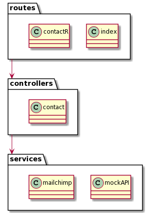
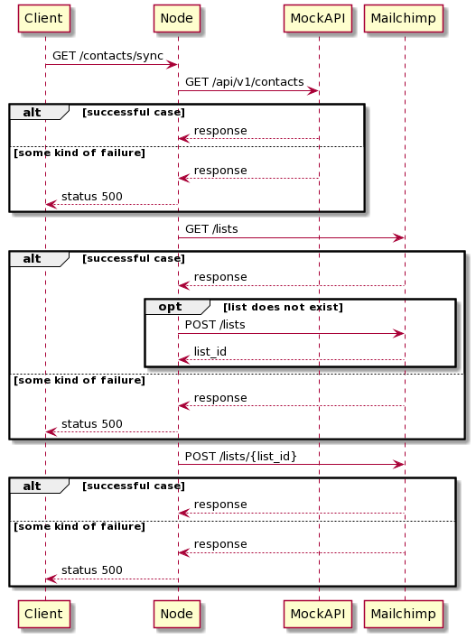

# contacts-synchronizer

## Technical Design

### Architecture

This project consists of a monolithic express.js web application. It is structured in 3 main layers:

- Routes
- Controllers
- Services

The routes layer contains everything related to the routing of the application. Here we can find the mappings of the api routes to their corresponding controllers, along with other routing configurations.

The controller layer is the orchestrator of the application routes. It uses the service layer and is responsible for interpreting and responding to incoming requests.

Finally we have the service layer. This layer encapsulates the interaction with third party providers: MockAPI and Mailchimp.

### Main flow

The main flow of this applications happens in the contact controller. The interaction between every actor is best described using a sequence diagram.

### Demo URL

https://contacts-synchronizer.herokuapp.com/contacts/sync

### Video URL

https://streamable.com/jpus5q